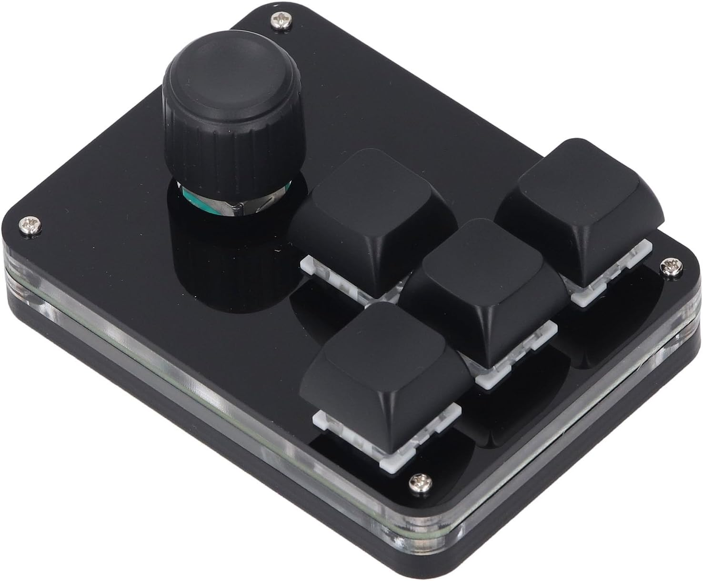

# macropad

Karabiner-Elements rules for a cheap USB macropad (4 keys + a rotary encoder), wired up to drive [cmux](https://cmux.com/) and [MacWhisper](https://goodsnooze.gumroad.com/l/macwhisper).



The hardware is the [Fafeicy 4 Key 1 Knob Programmable Macro Keypad](https://www.amazon.com.au/Fafeicy-Keyboard-Programmable-Switches-Productivity/dp/B0FZCGX42T/) (~AU$20 on Amazon AU) — blue mechanical switches and a clicky rotary encoder.

It reports as a USB keyboard with VID `20812` / PID `34897`.

## Hardware layout

| Physical input | Sends keycode |
|---|---|
| Encoder rotated left (CCW) | `1` |
| Encoder pressed (push-down) | `2` |
| Encoder rotated right (CW) | `3` |
| Top key of the T-cluster | `a` |
| Left key | `b` |
| Bottom key | `c` |
| Right key | `d` |

## What it does

| Macropad input | Global | In cmux.app | In Chrome |
|---|---|---|---|
| Encoder CCW (`1`) | — | Previous workspace (Ctrl+Cmd+[) | Page Up |
| Centre press (`2`) | **F18** → MacWhisper dictation | F18 | F18 |
| Encoder CW (`3`) | — | Next workspace (Ctrl+Cmd+]) | Page Down |
| Button `a` | — | Focus pane up (Cmd+Opt+↑) | — |
| Button `b` | — | Focus pane left (Cmd+Opt+←) | — |
| Button `c` | — | Focus pane down (Cmd+Opt+↓) | — |
| Button `d` | — | Focus pane right (Cmd+Opt+→) | — |
| Cmd held + encoder CCW | Previous app in switcher (Cmd+Shift+Tab) | | |
| Cmd held + encoder CW | Next app in switcher (Cmd+Tab) | | |

Outside cmux/Chrome, the keys (other than `2`) pass through unchanged.

## The two apps

### [cmux](https://cmux.com/)

A native macOS terminal designed for running multiple coding agents in parallel. It has vertical tabs, split panes, notification rings when an agent wants attention, an embedded scriptable browser, and a socket API — built on libghostty's renderer. The macropad bindings drive its tab/pane navigation:

- **Ctrl+Cmd+[ / ]** — previous / next workspace
- **Cmd+Opt+arrows** — move focus between split panes

Holding Cmd on the main keyboard and twirling the encoder gives a tactile Cmd+Tab — handy when you live in cmux but need to flick to another app for a second.

### [MacWhisper](https://goodsnooze.gumroad.com/l/macwhisper)

A macOS app for transcribing audio with OpenAI Whisper models, locally on your Mac. It supports a global push-to-talk hotkey for dictation — set it to **F18** in MacWhisper's preferences and the centre button on the macropad becomes a dedicated dictation key that works in any app.

## Installation

1. **Install [Karabiner-Elements](https://karabiner-elements.pqrs.org/)** if you don't have it. Grant the Input Monitoring / Accessibility permissions it asks for.

2. **Drop the rules file into Karabiner's import folder:**

   ```sh
   curl -L -o ~/.config/karabiner/assets/complex_modifications/macropad.json \
     https://raw.githubusercontent.com/schappim/macropad/master/macropad.json
   ```

3. **Import via the Karabiner UI:**
   - Open Karabiner-Elements → **Complex Modifications** tab → **Add predefined rule**
   - Find **Macropad mappings (VID 20812 / PID 34897)**
   - Click **Enable All** (or enable rules individually)

4. **Configure MacWhisper** (optional): in its preferences, bind the dictation / push-to-talk shortcut to **F18**.

## Adapting to a different macropad

If your macropad reports a different VID/PID, you'll need to update them in `macropad.json`. To find yours:

1. Open Karabiner-Elements → **Devices** tab — the VID and PID are listed next to each connected keyboard.
2. In `macropad.json`, find/replace every `"vendor_id": 20812, "product_id": 34897` with your values.
3. Re-import via the Complex Modifications tab.

If your macropad sends different key codes than `a`/`b`/`c`/`d`/`1`/`2`/`3`, use Karabiner's **EventViewer** (under the menu bar icon) to see what each button sends, then update the `"key_code"` values in the rules accordingly.
